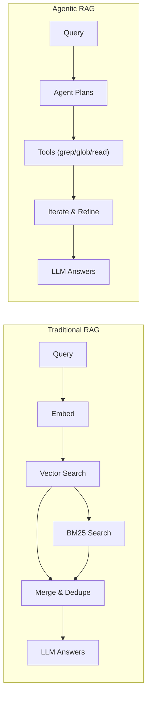
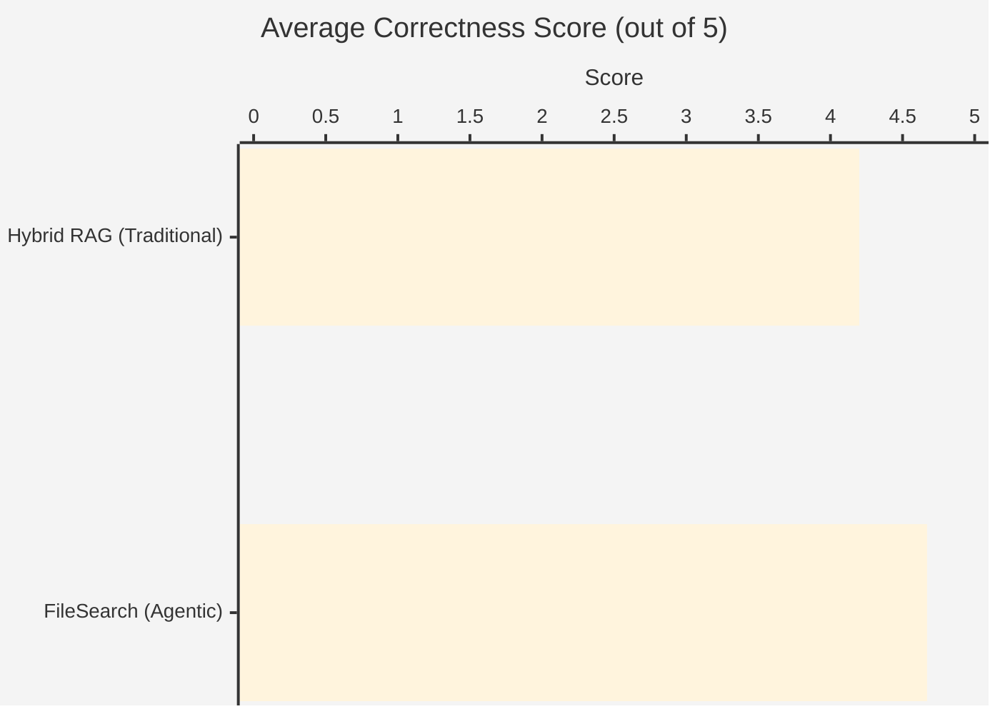
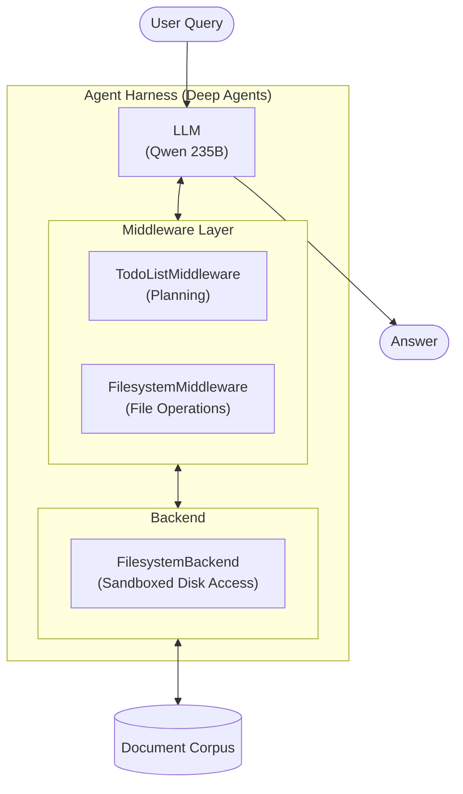
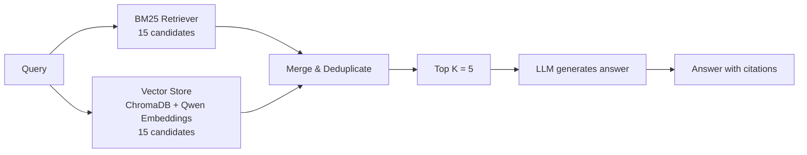
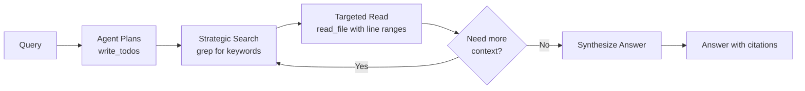

# Agent-Harness-RAG

> **A curious experiment: What happens when we give LLMs the keys to their own retrieval?**

---

## The LLM World is Changing

The world of Large Language Models is undergoing a fundamental transformation. We've moved from LLMs as **predictive models**—"What is the capital of France?"—to LLMs as **problem solvers**—"Figure out how to debug this distributed system."

This shift is reflected in how we benchmark these systems:

| Era | Benchmarks | What They Measure |
|-----|-----------|-------------------|
| **Then** | HumanEval, MathEval, MMLU | Knowledge retrieval, pattern matching |
| **Now** | SWE-Bench, Tau-Bench, GAIA | Autonomous problem-solving, tool use, multi-step reasoning |

The old paradigm of RAG (Retrieval-Augmented Generation) was simple: embed documents, find similar chunks, stuff them into context. But if LLMs can now *reason* and *plan*, why are we still hand-holding their retrieval?

**What if we just... gave them the tools and let them figure it out?**

This is where **Agent Harnesses** enter the picture. Think of it like giving Jarvis to Tony Stark—suddenly you're not just a genius in a workshop, you're Iron Man. The harness doesn't replace the intelligence; it *amplifies* it.

LangChain's **Deep Agents** framework is one such harness. It wraps an LLM with planning capabilities (TodoListMiddleware) and filesystem tools (grep, glob, read_file), then lets the agent orchestrate its own retrieval strategy.

**So we decided to take it for a spin.**

---

## The Experiment

We built two RAG agents and put them head-to-head:



| Agent | Approach | Philosophy |
|-------|----------|------------|
| **hybrid_rag_agent** | BM25 + Vector Search | "I know where to look" |
| **filesearch_agent** | grep/glob/read_file tools | "Let me figure out where to look" |

Both agents use the same LLM (Qwen/Qwen3-235B), the same document corpus, and the same LangGraph harness. The only difference is *how they retrieve information*.

---

## Results Summary

**44 questions. 11 categories. One winner (with caveats).**

| Metric | Hybrid RAG | FileSearch (Agentic) | Verdict |
|--------|-----------|---------------------|---------|
| **Accuracy** | 4.20/5 | **4.67/5** | FileSearch +11% |
| **Perfect Scores (5/5)** | 53% | **80%** | FileSearch +27% |
| **Latency (median)** | **31s** | 58s | Hybrid 1.9x faster |
| **Tokens (median)** | **12,137** | 37,294 | Hybrid 3.1x cheaper |
| **Tool Calls (median)** | **2** | 6 | Hybrid 3x fewer |

### Accuracy Comparison



<table>
<tr>
<td align="center" width="50%">

**Hybrid RAG**
`████████████████░░░░` **4.20/5**
<br><sub>🔘 Steel Grey — Fast & Efficient</sub>

</td>
<td align="center" width="50%">

**FileSearch (Agentic)**
`███████████████████░` **4.67/5**
<br><sub>🔴 Salmon — Accurate & Thorough</sub>

</td>
</tr>
</table>

### The Interesting Part: Category Breakdown

| Category | Hybrid | FileSearch | Winner |
|----------|--------|------------|--------|
| table_data | 3.8 | **5.0** | FileSearch |
| semantic | 4.2 | **5.0** | FileSearch |
| conceptual | 4.4 | **5.0** | FileSearch |
| temporal | **4.7** | 4.0 | Hybrid |
| negation | 3.3 | 3.7 | FileSearch |
| contextual | 3.5 | 3.8 | FileSearch |

**Key Findings:**

1. **FileSearch dominates structured data** — Tables, formulas, semantic queries: the agent's ability to iteratively search and read specific sections pays off
2. **Hybrid wins on temporal queries** — When you need "the 2014 WMT dataset," keyword matching just works
3. **Both struggle with negation and context** — "What does this book NOT cover?" remains hard for everyone

---

## The Deep Dive

### What is an Agent Harness?

An agent harness is infrastructure that transforms an LLM from a question-answering system into an autonomous agent. It provides:



The **FileSearch agent** uses this harness to:
1. **Plan** the search strategy (write_todos)
2. **Execute** iterative searches (grep → read_file → grep again)
3. **Synthesize** answers from discovered content

### Why Hybrid RAG Exists

We didn't start with a fair fight. Our initial vector-only RAG was... broken.

```
Query: "attention mechanism"
Vector Search Results: 1/5 relevant chunks (score: 0.27)
BM25 Search Results:   5/5 relevant chunks

Diagnosis: Embeddings pipeline producing low-quality similarity scores
Solution:  BM25 compensates for vector weakness → Hybrid approach
```

The hybrid approach combines:
- **BM25**: Perfect keyword matching (15 candidates)
- **Vector**: Semantic similarity (15 candidates)
- **Merge**: Deduplicate and return top-k

This gives us a strong baseline that represents "traditional RAG done right."

### Document Corpus

Three documents covering different domains:

| Document | Domain | Size |
|----------|--------|------|
| attention_is_all_you_need.md | ML Research | Transformer paper |
| thinkpython2.md | Programming | Python textbook |
| The Essence of Software Engineering.md | Software Engineering | SE principles |

**Total:** 3,370 chunks (512 chars, 50 overlap) indexed in ChromaDB

### Evaluation Methodology

**44 questions** across 11 categories, designed to stress-test different retrieval scenarios:

| Category | Count | What It Tests |
|----------|-------|---------------|
| exact_match | 5 | Finding specific terms, codes, identifiers |
| semantic | 6 | Understanding meaning despite different wording |
| table_data | 4 | Extracting from tables and structured data |
| formulas | 4 | Retrieving equations and mathematical content |
| multi_hop | 5 | Synthesizing info from multiple sources |
| acronyms | 3 | Bridging technical shorthand |
| contextual | 4 | Same word, different contexts |
| negation | 3 | Understanding "not", "without" |
| temporal | 3 | Time-based and version queries |
| factual | 4 | Exact numbers, dates, names |
| conceptual | 5 | High-level "why" and "how" questions |

**Scoring:** LLM-as-judge (same model) rates each answer 1-5:
- **5** = Perfect, complete, accurate
- **4** = Mostly correct, minor omissions
- **3** = Partially correct, missing key details
- **2** = Mostly incorrect or incomplete
- **1** = Wrong or irrelevant

---

## Architecture Details

### Hybrid RAG Agent



**Tools:** `hybrid_search`, `bm25_only_search`, `vector_only_search`

### FileSearch RAG Agent



**Tools:** `grep`, `glob`, `read_file`, `ls`, `write_todos`, `read_todos`

---

## Technology Stack

| Component | Technology |
|-----------|------------|
| **LLM** | Qwen/Qwen3-235B-A22B-Instruct-2507-FP8 |
| **Embeddings** | Qwen/Qwen3-Embedding-8B (4096 dims) |
| **Agent Framework** | LangGraph + Deep Agents |
| **Vector Store** | ChromaDB |
| **BM25** | LangChain BM25Retriever |
| **Chunking** | RecursiveCharacterTextSplitter (512 chars) |

---

## Observations & Insights

### Why FileSearch Wins on Accuracy

The agentic approach shines when:

1. **Information is scattered** — The agent can grep, find a lead, then read surrounding context
2. **Tables need parsing** — Iterative reads let it find the right rows/columns
3. **Semantic understanding is needed** — Multiple search attempts with refined queries

### Why Hybrid Wins on Efficiency

Pre-computed retrieval wins when:

1. **Keywords are sufficient** — "dmodel = 512" just needs keyword matching
2. **Context is predictable** — Similar questions have similar retrieval patterns
3. **Cost matters** — 3x fewer tokens = 3x cheaper at scale

### The Hard Problems

Both agents struggle with:

- **Negation**: "What is NOT mentioned?" requires knowing what's NOT there
- **Contextual disambiguation**: "What does 'function' mean in Python vs. Transformers?"
- **Cross-document reasoning**: Synthesizing insights across all three documents

### Outliers & Edge Cases

Two queries caused runaway behavior in FileSearch (excluded from stats):
- **q037**: 9M tokens, 34 minutes (iterative search loop)
- **q045**: 9M tokens, 14 minutes (exhaustive document scan)

This highlights the risk of agentic approaches: without guardrails, agents can spiral.

---

## When to Use What

| Scenario | Recommended | Why |
|----------|-------------|-----|
| Production (cost-sensitive) | **Hybrid RAG** | 3x cheaper, predictable latency |
| High accuracy required | **FileSearch** | +11% accuracy, better on complex queries |
| Table/structured data | **FileSearch** | Iterative search finds exact rows |
| Simple factual queries | **Hybrid RAG** | Keywords just work |
| High throughput | **Hybrid RAG** | 2x faster, no agent planning overhead |

---

## Running the Experiment

### Quick Start

```bash
# Install dependencies
python -m venv .venv
source .venv/bin/activate
pip install -r requirements.txt

# Initialize vector store
python scripts/init_vectorstore.py

# Start LangGraph server
langgraph dev --port 2026

# Run benchmark
python src/benchmark_agents.py
```

### Configuration

```bash
# .env file
LLM_BASE_URL=http://10.26.1.56:8708/v1
LLM_MODEL=Qwen/Qwen3-235B-A22B-Instruct-2507-FP8
EMBEDDINGS_BASE_URL=http://10.26.1.11:8786/v1
```

---

## Repository Structure

```
Agent-Harness-RAG/
├── agents/
│   ├── hybrid_rag_agent.py      # BM25 + Vector hybrid
│   └── filesearch_agent.py      # Agentic file search
├── src/
│   ├── benchmark_agents.py      # Benchmark orchestrator
│   ├── langgraph_client.py      # LangGraph API client
│   └── llm_judge.py             # LLM-as-judge evaluator
├── evaluation/
│   ├── datasets/
│   │   └── evaluation_set.jsonl # 44 test questions
│   └── results/                 # Benchmark outputs
├── rag_data/
│   └── processed/               # Document corpus (markdown)
└── chroma_db/                   # Vector store
```

---

## Future Directions

### Tool Enhancements
- **MCP Integration**: Adopt Model Context Protocol tools for better terminal and markdown parsing
- **Image Processing**: Enable LLMs to read diagrams and figures from documents

### Document Processing
- **Better PDF Parsing**: Preserve tables, formulas, and structure during conversion
- **Chunk Optimization**: Experiment with semantic chunking vs. fixed-size

### Evaluation
- **Larger Dataset**: More questions, especially for hard categories (negation, contextual)
- **Planning Metrics**: Measure agent's search strategy quality, not just final answer

### Agent Improvements
- **Guardrails**: Token/time limits to prevent runaway queries
- **Caching**: Reuse search results across similar queries
- **Hybrid Agent**: Combine pre-computed retrieval with agentic refinement

---

## Conclusion

**The agentic approach works.** Giving an LLM the tools to control its own retrieval produces measurably better answers—at least for complex queries involving structured data, semantic understanding, and multi-step reasoning.

**But it's not free.** The 11% accuracy gain comes with 3x token cost and 2x latency. For high-volume production systems, hybrid RAG remains the pragmatic choice.

The most exciting possibility? A **hybrid of hybrids**: use fast pre-computed retrieval for simple queries, escalate to agentic search when confidence is low. The best of both worlds.

This was a curious experiment with interesting results. The LLM world really is changing, and agent harnesses like Deep Agents are just the beginning.

---

## Contributing

We welcome contributions! Areas where you can help:

- **Evaluation Dataset**: Add new test questions, especially for challenging categories
- **Tool Development**: Build MCP tools for markdown parsing and document processing
- **Agent Improvements**: Enhance planning prompts and retrieval strategies
- **Documentation**: Improve guides and add examples

Feel free to open issues or submit pull requests.

---

## References

- [LangGraph Documentation](https://langchain-ai.github.io/langgraph/)
- [Deep Agents Overview](https://docs.langchain.com/oss/python/deepagents/overview)
- [ChromaDB Integration](https://python.langchain.com/docs/integrations/vectorstores/chroma/)
- [BM25 Retriever](https://python.langchain.com/docs/integrations/retrievers/bm25/)

---

## License

MIT License
