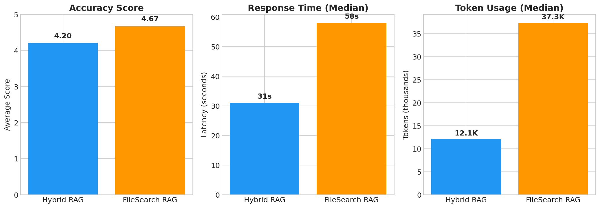
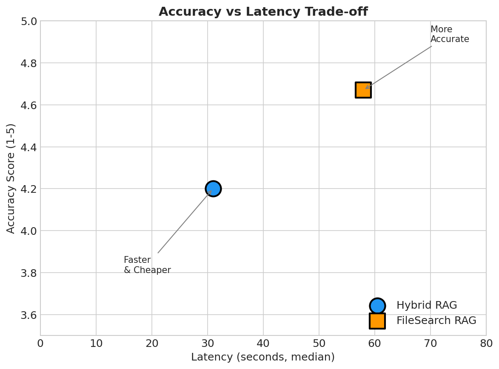
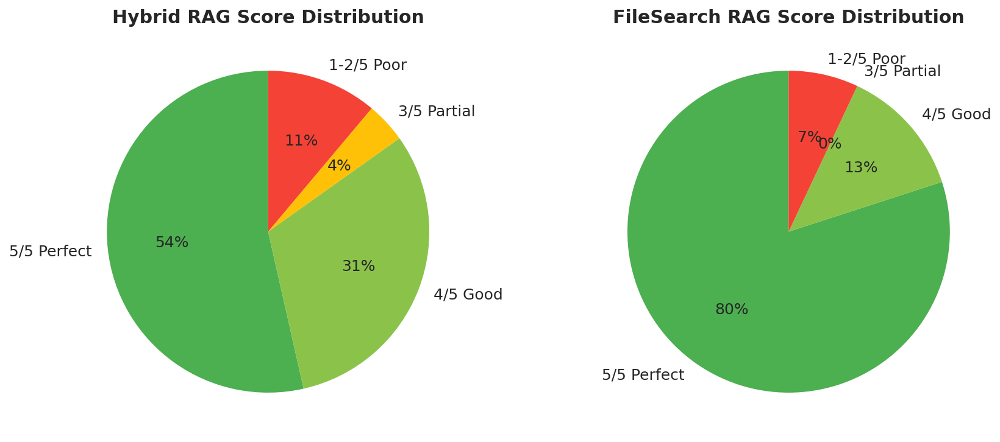
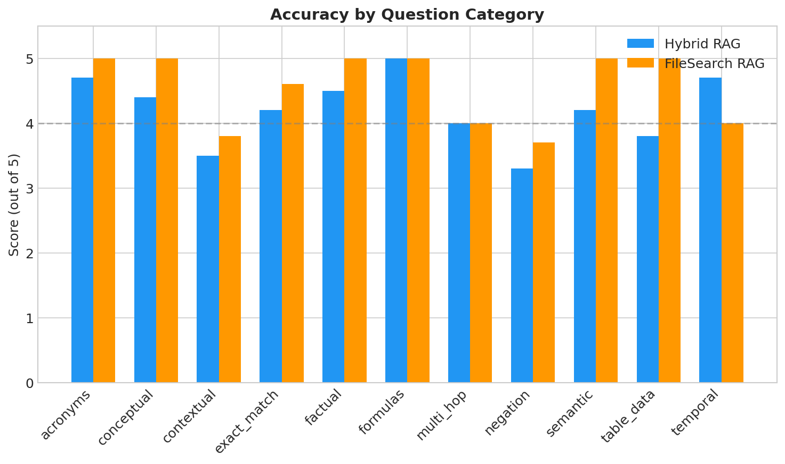

# Agent-Harness-RAG

> **Systematic comparison of RAG approaches: Hybrid RAG vs FileSearch RAG**

## Project Objective

This repository provides a framework to **scientifically evaluate and compare RAG (Retrieval-Augmented Generation) approaches** for document question-answering:

1. **Hybrid RAG** - Combines BM25 keyword matching + ChromaDB vector similarity search
2. **FileSearch RAG** - Agentic search using grep/glob/read_file tools (Deep Agents)

**Goal:** Make data-driven decisions about which RAG approach works best for different use cases.

---

## Benchmark Results

### Summary (44 Questions, Outliers Excluded)

| Metric | hybrid_rag_agent | filesearch_agent | Ratio |
|--------|------------------|------------------|-------|
| **Avg Score** | 4.20/5 | **4.67/5** | +11% |
| **Latency (median)** | **31s** | 58s | 1.9x slower |
| **Tokens (median)** | **12,137** | 37,294 | 3.1x more |
| **Tool Calls (median)** | **2** | 6 | 3x more |
| **Perfect Scores (5/5)** | 53% | **80%** | +27% |

> **Note on Benchmark Conditions:**
> - **Model:** Qwen/Qwen3-235B-A22B-Instruct-2507-FP8
> - **Throughput during benchmark:** ~20 tokens/second (degraded)
> - **Typical throughput:** 60-70 tokens/second
> - **Controlled variables:** Both agents use the same LangGraph agent harness and Deep Agents planning layer. The only difference is the retrieval mechanism (Hybrid RAG vs FileSearch tools).
>
> Latency results are ~3x higher than expected due to reduced model throughput during testing. Under normal conditions (60-70 TPS), expect latencies of approximately **10s for Hybrid** and **20s for FileSearch**.

### Overall Comparison



### Accuracy vs Latency Trade-off



### Score Distribution



### Accuracy by Category



### Performance by Category

| Category | Hybrid | FileSearch | Winner |
|----------|--------|------------|--------|
| acronyms | 4.7 | 5.0 | FileSearch |
| conceptual | 4.4 | 5.0 | FileSearch |
| contextual | 3.5 | 3.8 | FileSearch |
| exact_match | 4.2 | 4.6 | FileSearch |
| factual | 4.5 | 5.0 | FileSearch |
| formulas | 5.0 | 5.0 | Tie |
| multi_hop | 4.0 | 4.0 | Tie |
| negation | 3.3 | 3.7 | FileSearch |
| semantic | 4.2 | 5.0 | FileSearch |
| table_data | 3.8 | 5.0 | FileSearch |
| temporal | **4.7** | 4.0 | Hybrid |

### Key Findings

1. **FileSearch is more accurate** (4.67 vs 4.20) but uses 3x more resources
2. **Hybrid is faster and cheaper** - ideal for high-volume production use
3. **Both struggle with contextual and negation queries** (scores 3.3-3.8)
4. **Hybrid wins on temporal queries** (4.7 vs 4.0)
5. **FileSearch excels at table_data and semantic queries** (5.0 vs 3.8-4.2)

### Recommendation

| Use Case | Recommended Agent |
|----------|-------------------|
| Production (cost-sensitive) | **hybrid_rag_agent** |
| High accuracy required | **filesearch_agent** |
| Formula/factual queries | Either (both excel) |
| Table data extraction | filesearch_agent |
| High throughput | hybrid_rag_agent |

---

## Evaluation Methodology

### Dataset

- **44 evaluation questions** across 11 categories
- Questions sourced from 3 documents:
  - `attention_is_all_you_need.md` (Transformer paper)
  - `thinkpython2.md` (Python programming book)
  - `The Essence of Software Engineering.md` (SE principles)

### Question Categories

| Category | Count | Description |
|----------|-------|-------------|
| exact_match | 5 | Finding specific terms, codes, identifiers |
| semantic | 6 | Understanding meaning despite different wording |
| table_data | 4 | Extracting from tables and comparisons |
| formulas | 4 | Retrieving equations and calculations |
| multi_hop | 5 | Synthesizing info from multiple sources |
| acronyms | 3 | Bridging technical shorthand |
| contextual | 4 | Same word, different contexts |
| negation | 3 | Understanding "not", "without" |
| temporal | 3 | Time-based and version queries |
| factual | 4 | Exact numbers, dates, names |
| conceptual | 5 | High-level "why" and "how" questions |

### Metrics Collected

| Metric | Description |
|--------|-------------|
| **Correctness Score** | LLM-as-judge evaluation (1-5 scale) |
| **Latency** | End-to-end response time (ms) |
| **Token Usage** | Total input + output tokens |
| **Tool Calls** | Number of tool invocations |

### LLM-as-Judge Evaluation

Each answer is evaluated by the same LLM (Qwen/Qwen3-235B-A22B-Instruct-2507-FP8) using a structured prompt:

```
Score 1-5:
5 = Perfect, complete, accurate answer
4 = Mostly correct with minor omissions
3 = Partially correct, missing key details
2 = Mostly incorrect or very incomplete
1 = Wrong or irrelevant answer
```

### Outlier Handling

Queries with runaway behavior (>1M tokens or >5 min latency) are excluded from aggregate statistics to prevent skewing:
- **q037** (filesearch): 9M tokens, 34 min
- **q045** (filesearch): 9M tokens, 14 min

Median values are used for latency and token metrics to reduce outlier impact.

---

## Architecture

### Hybrid RAG Agent

```
┌─────────────────────────────────────────────────────────┐
│                    hybrid_rag_agent                     │
├─────────────────────────────────────────────────────────┤
│  1. Query received                                      │
│  2. BM25 keyword search (LangChain BM25Retriever)       │
│  3. Vector similarity search (ChromaDB + Qwen embeddings)│
│  4. Merge & deduplicate results                         │
│  5. LLM generates answer from retrieved chunks          │
└─────────────────────────────────────────────────────────┘
```

**Tools:** `hybrid_search` (BM25 + vector combined)

### FileSearch RAG Agent

```
┌─────────────────────────────────────────────────────────┐
│                   filesearch_agent                      │
├─────────────────────────────────────────────────────────┤
│  1. Query received                                      │
│  2. Agent plans search strategy                         │
│  3. Uses tools iteratively:                             │
│     - glob: Find files by pattern                       │
│     - grep: Search content with regex                   │
│     - read_file: Read file contents                     │
│  4. Agent synthesizes answer from findings              │
└─────────────────────────────────────────────────────────┘
```

**Tools:** `glob`, `grep`, `read_file`

---

## Technology Stack

### Models (Local Deployment)

| Component | Model | Endpoint |
|-----------|-------|----------|
| **LLM** | Qwen/Qwen3-235B-A22B-Instruct-2507-FP8 | http://10.26.1.56:8708/v1 |
| **Embeddings** | Qwen/Qwen3-Embedding-8B (4096 dims) | http://10.26.1.11:8786/v1 |

### Framework

| Component | Technology |
|-----------|------------|
| Agent Orchestration | LangGraph + Deep Agents |
| Vector Store | ChromaDB (3,370 chunks) |
| BM25 Search | LangChain BM25Retriever |
| Chunking | RecursiveCharacterTextSplitter (512 chars, 50 overlap) |
| API Server | LangGraph CLI (port 2026) |

---

## Repository Structure

```
Agent-Harness-RAG/
├── README.md                          # This file
├── .env                               # Environment configuration
├── requirements.txt                   # Python dependencies
├── langgraph.json                     # LangGraph deployment config
│
├── agents/                            # RAG Agent implementations
│   ├── hybrid_rag_agent.py            # Hybrid RAG (BM25 + Vector)
│   └── filesearch_agent.py            # FileSearch RAG (Deep Agents)
│
├── src/                               # Core modules
│   ├── benchmark_agents.py            # Benchmark orchestrator
│   ├── langgraph_client.py            # LangGraph API client
│   ├── llm_judge.py                   # LLM-as-judge evaluator
│   ├── vectorstore_rag.py             # Vector store utilities
│   └── filesearch_rag.py              # FileSearch utilities
│
├── evaluation/                        # Evaluation framework
│   ├── datasets/
│   │   └── evaluation_set.jsonl       # 44 test questions
│   ├── results/
│   │   ├── benchmark_*.csv            # Benchmark results
│   │   └── benchmark_*.jsonl          # Detailed results
│   ├── framework.md                   # Evaluation methodology
│   └── dataset_schema.md              # Question schema
│
├── scripts/                           # Setup scripts
│   ├── init_vectorstore.py            # Initialize ChromaDB
│   └── preprocess_pdfs.py             # PDF to markdown
│
├── rag_data/                          # Document corpus
│   └── processed/                     # Preprocessed markdown
│       ├── attention_is_all_you_need.md
│       ├── thinkpython2.md
│       └── The Essence of Software Engineering.md
│
├── chroma_db/                         # ChromaDB persistent storage
│
└── docs/                              # Additional documentation
    ├── HYBRID_RAG_IMPLEMENTATION.md
    ├── DEPLOYMENT.md
    └── ...
```

---

## Quick Start

### 1. Install Dependencies

```bash
python -m venv .venv
source .venv/bin/activate
pip install -r requirements.txt
```

### 2. Configure Environment

```bash
# .env file
LLM_BASE_URL=http://10.26.1.56:8708/v1
LLM_MODEL=Qwen/Qwen3-235B-A22B-Instruct-2507-FP8
EMBEDDINGS_BASE_URL=http://10.26.1.11:8786/v1
```

### 3. Initialize Vector Store

```bash
python scripts/init_vectorstore.py
```

### 4. Start LangGraph Server

```bash
langgraph dev --port 2026
```

### 5. Run Benchmark

```bash
python src/benchmark_agents.py
```

Results are saved to `evaluation/results/benchmark_*.csv`

---

## Benchmark Files

| File | Description |
|------|-------------|
| `src/benchmark_agents.py` | Main benchmark orchestrator |
| `src/langgraph_client.py` | HTTP client for LangGraph API |
| `src/llm_judge.py` | LLM-as-judge implementation |
| `evaluation/datasets/evaluation_set.jsonl` | 44 test questions |
| `evaluation/results/*.csv` | Benchmark results |

---

## Known Issues

### Runaway Queries

Some questions cause excessive token usage (>1M tokens):
- Vague "what was excluded" type questions
- Cross-document comparison queries

**Mitigation:** These are excluded from aggregate statistics.

### Challenging Categories

Both agents struggle with:

**Contextual disambiguation** (3.5-3.8/5)
- *Example:* "What does 'layer' mean in the Transformer vs in Think Python?"
- *Example:* "How is 'function' used differently in the Transformer paper vs programming?"

**Negation queries** (3.3-3.7/5)
- *Example:* "What features does Think Python NOT cover?"
- *Example:* "Which attention mechanisms are NOT used in the Transformer?"

---

## Future Improvements

### Tool Enhancements
- **MCP Integration**: Adopt latest MCPs built for terminal and markdown parsing - extracting titles, table of contents, structured sections, and enabling image processing for LLMs

### Document Processing
- **Nemoron Parser V1.1**: Process documents with accurate PDF/document to Markdown conversion, preserving format, sections, tables, formulas, images, and references
- **Planning Prompts**: Update agent planning prompts for more effective retrieval workflows

### Evaluation Framework
- **Comprehensive Dataset**: Expand question set with more edge cases and diverse query types
- **Planning Metrics**: Evaluate agent's planning capability for complex queries

---

## Contributing

We welcome contributions! Areas where you can help:

- **Evaluation Dataset**: Add new test questions, especially for challenging categories
- **Tool Development**: Build MCP tools for markdown parsing and document processing
- **Agent Improvements**: Enhance planning prompts and retrieval strategies
- **Documentation**: Improve guides and add examples

Feel free to open issues or submit pull requests.

---

## References

- [LangGraph Documentation](https://langchain-ai.github.io/langgraph/)
- [Deep Agents Overview](https://docs.langchain.com/oss/python/deepagents/overview)
- [ChromaDB Integration](https://python.langchain.com/docs/integrations/vectorstores/chroma/)
- [BM25 Retriever](https://python.langchain.com/docs/integrations/retrievers/bm25/)

---

## License

MIT License
